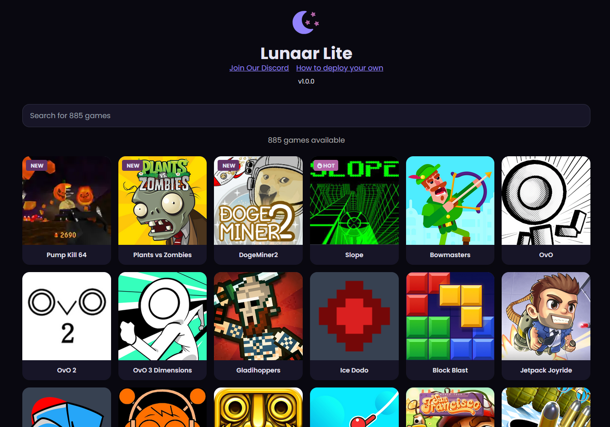

# Lunaar Lite

A lite version of the Lunaar Site featuring a modern design with over 800+ games.

## Features

- **Modern Design**: Sleek, responsive UI with dark theme and smooth animations.
- **800+ Games**: Extensive collection of browser-based games.
- **Fast Loading**: Optimized for quick access and minimal load times.
- **Fully Static**: You can deploy almost anywhere!

## Deployment

To deploy your own instance of Lunaar Lite, follow the deployment guide at [https://docs.lunaar.org/deployment/lite/](https://docs.lunaar.org/deployment/lite/).

### Forking

If you fork this repository, remember to sync your fork periodically to keep the games list updated and ensure all games continue working properly.
